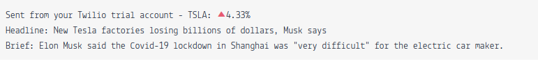

# Stock-News

### [twitter](https://twitter.com/achte_te)

## Description

A program that send text messages using Twilio API, if TESLA stocks closing price has changed over 5% for the last two financial working days. Stock data is obtained using Alpha Vantage API. The text message also contains 3 news articles regarding the particular stock/company. News data is obtained using News API. The code is hosted on [pythonanywhere](https://www.pythonanywhere.com/).

## Requirements

[Python](https://www.python.org/)

```sh
$ python3 --version
Python 3.9.12
```

[os](https://docs.python.org/3/library/os.html)

[requests](https://pypi.org/project/requests/)

[News API](https://newsapi.org/)

[Stocks API](https://www.alphavantage.co/)

[twilio](https://www.twilio.com/)

## Install

```sh
$ git clone git@github.com:achte-2022/Stock-News.git
```

## Setting Up Environment Variables

### Environment Variables are DUMMY values

```sh
$ cd Stock-News
$ export STOCK_API_KEY=HSIWK373639FJSDFN;
$ export STOCK_API_ENDPOINT=https://www.alphavantage.co/query;
$ export NEWS_API_KEY=AKDSJFH840542N2324DFK;
$ export NEWS_API_ENDPOINT=https://newsapi.org/v2/everything;
$ export AUTH_TOKEN=JIEMADSKFNQI38245729;
$ export ACCOUNT_SID=ASDFIR84JGGO39273;
$ export TO_NUMBER=+11234567890;
$ export FROM_NUMBER=+11234567890;
```

## Run

```sh
$ cd Stock-News
$ python3 main.py
```

## Message


